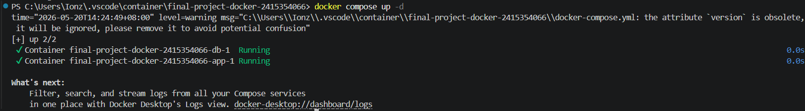
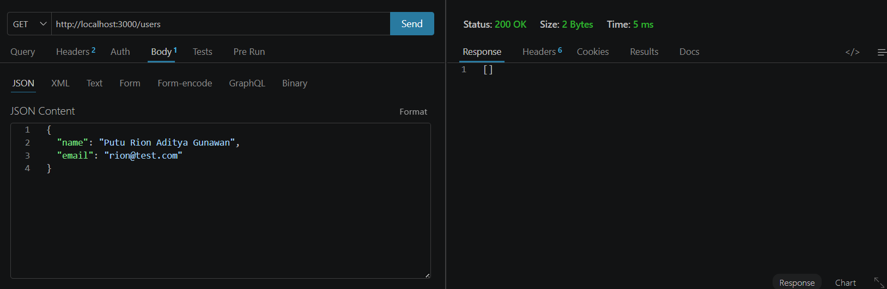
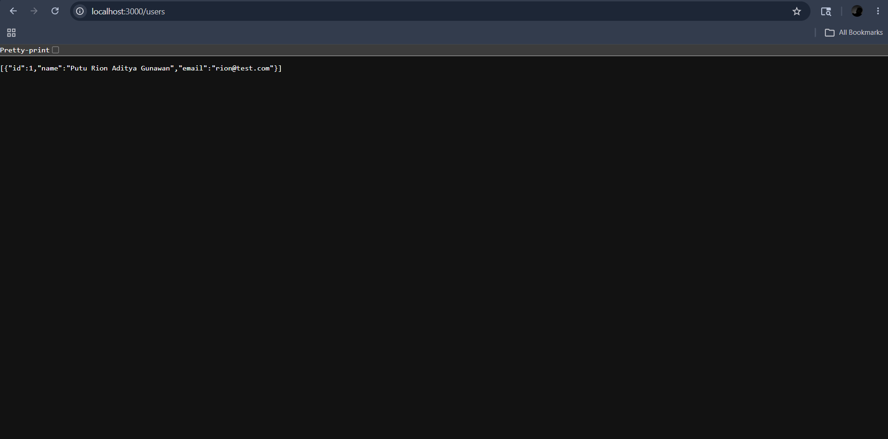
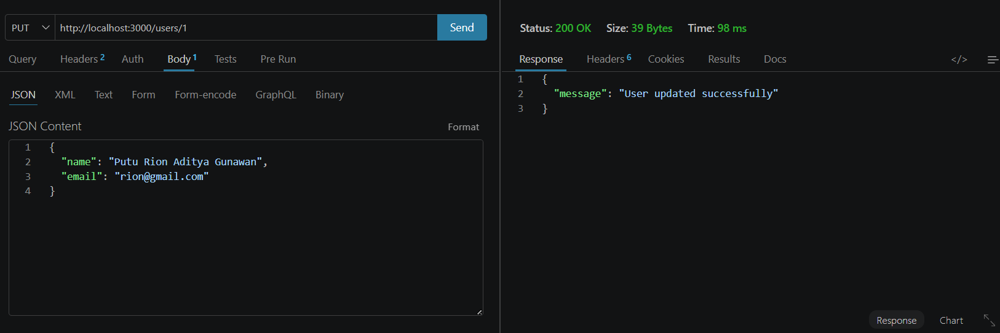
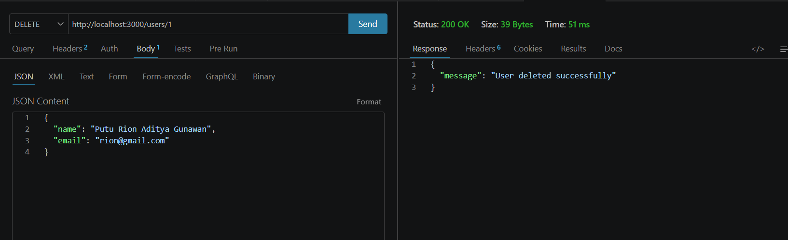
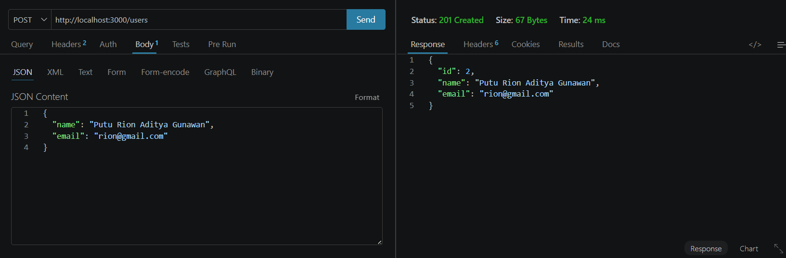
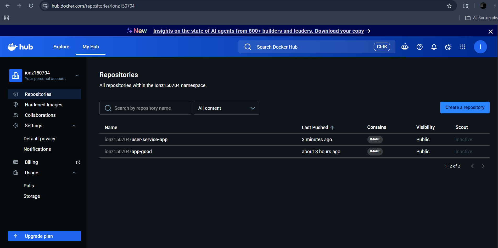

# Laporan Hasil Praktikum: Final Project Aplikasi Berbasis Container

## Identitas Mahasiswa

- **Nama:** Putu Rion Aditya Gunawan
- **NIM:** 2415354066
- **Kelas/Rombel:** TRPL 4B
- **Tanggal Praktikum:** 20 Mei 2026

---

## Teknologi & Tools yang Digunakan

- **Sistem Operasi:** Windows 11
- **Containerization:** Docker & Docker Hub
- **Bahasa Pemrograman / Framework:** Node.js
- **Database:** MySQL
- **Tools Lain:** VS Code, Git, Thunder Client

---

## Langkah-Langkah Praktikum & Dokumentasi

### Langkah 1: Pengujian Docker Compose, Volume, Network, Container
Menjalankan multi-container application (Backend Node.js & Database MySQL) menggunakan perintah `docker compose up`. Docker Compose otomatis membuat volume untuk persistensi data database dan custom bridge network agar kedua service dapat berkomunikasi.

**Dokumentasi/Screenshot:**

---

### Langkah 2: Pengujian Endpoint -> Request dan Response
Pengujian fitur CRUD REST API dengan mengirim HTTP request GET dan POST ke service backend yang mengekspos port 3000 ke host.

**Dokumentasi/Screenshot:**

---

### Langkah 3: Pengujian upload ke Docker Hub
Melakukan proses _tagging_ pada Docker image aplikasi lokal agar sesuai dengan format repository Docker Hub, lalu mem-push image tersebut ke registry publik.

**Dokumentasi/Screenshot:**

---

## Kesimpulan
Praktikum berjalan lancar. Aplikasi backend Node.js dan database MySQL berhasil diisolasi dan dijalankan menggunakan pendekatan multi-container architecture. Docker network memfasilitasi komunikasi antar container tanpa terekspos langsung keluar, sementara environment variables di-manage dengan aman melalui file `.env`. Data pada database juga berhasil dipersistensi menggunakan Docker volume, sehingga tidak hilang meski container dihentikan.